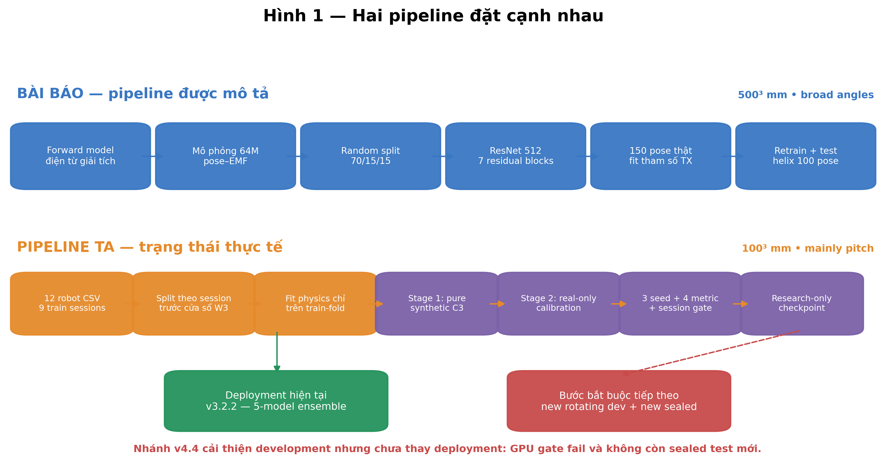
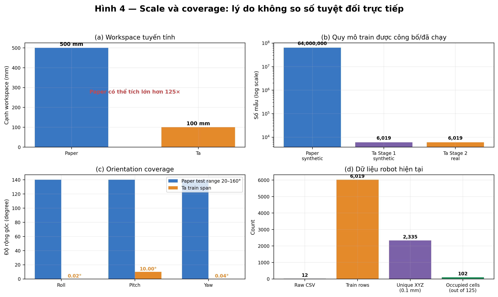
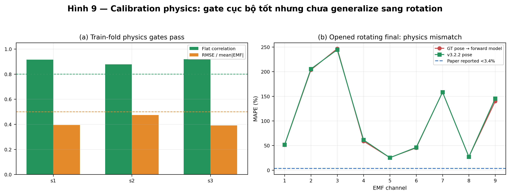
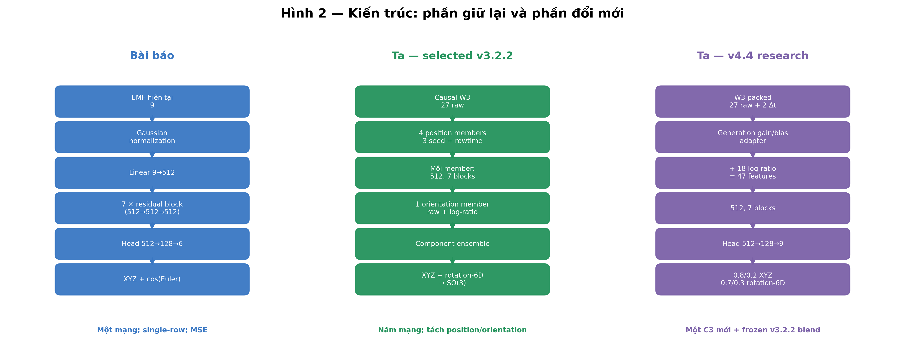
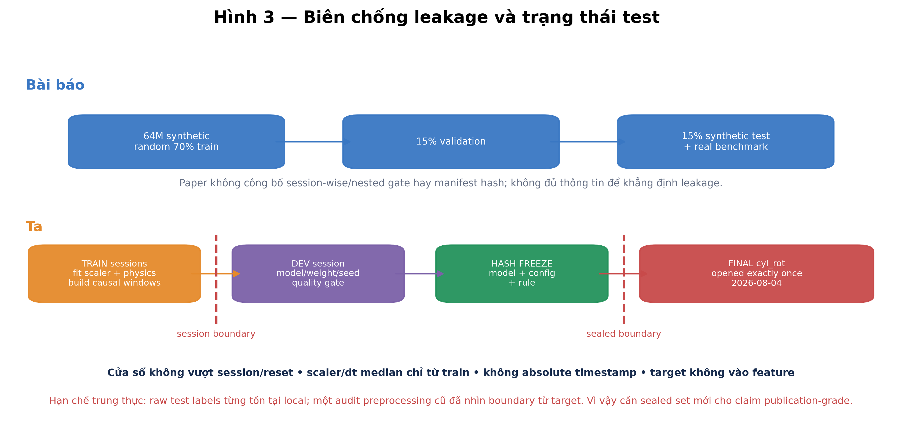
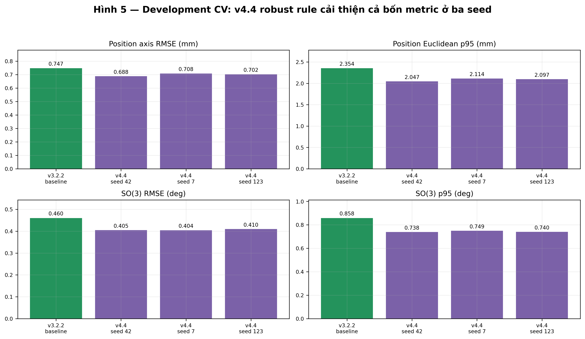
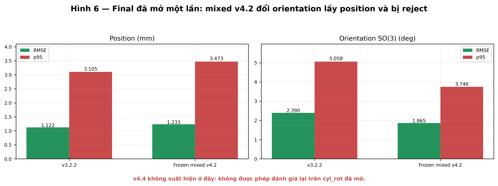
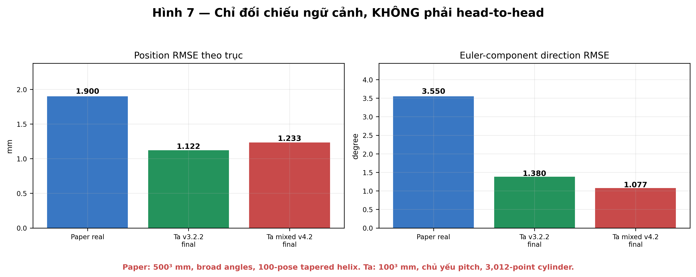
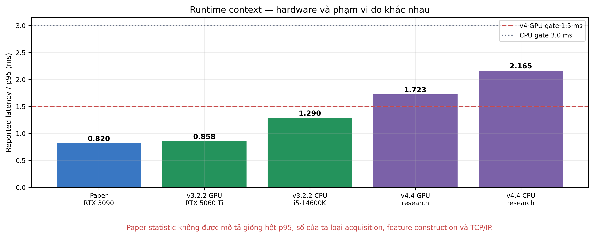
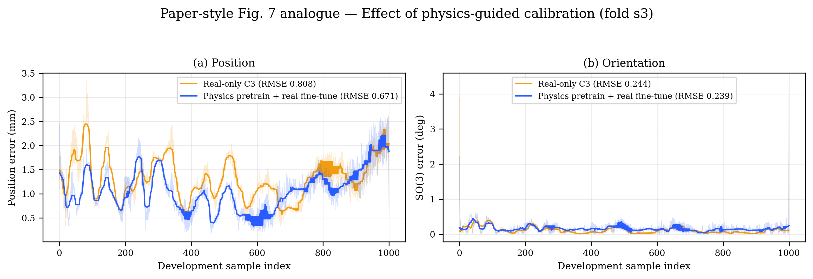

# Báo cáo kiểm toán: tái tạo bài báo và pipeline EMF hiện tại

Ngày dựng: **2026-08-05**. Đây là báo cáo reporting-only. Script chỉ đọc summary/artifact đã đóng băng, không chạy inference final, không mở raw label `cyl_rot`, không chọn lại model và không đổi deployment.

Bài báo tham chiếu: [Residual Neural Network for Precise 6-DoF Capsule Endoscope Localization Using Electromagnetic Induction](../../Residual_Neural_Network_for_Precise_6-DoF_Capsule_Endoscope_Localization_Using_Electromagnetic_Induction.pdf), IEEE TIM, DOI `10.1109/TIM.2026.3655917`.

## 1. Kết luận ngắn gọn nhưng không đánh tráo

Ta **đi đúng hướng**, nhưng chưa thể gọi là “tái tạo tốt toàn bộ bài báo”. Có thể chia mức độ thành bốn lớp:

1. **Đã tái tạo gần:** bài toán 9 EMF → 6-DoF; forward physics cùng họ; backbone width 512, 7 residual blocks, hai linear mỗi block, LeakyReLU 0.01; inference GPU ở mức dưới 1 ms cho deployment hiện tại.
2. **Đã thay đổi có chủ đích:** causal W3, log-ratio, rotation-6D, ensemble tách position/orientation, generation adapter, spatial/session sampler, grouped CV, multi-seed và final gate.
3. **Protocol của ta rõ/chặt hơn phần paper công bố:** split theo session trước khi tạo window; scaler/physics chỉ fit train fold; target không vào feature; absolute timestamp bị cấm; hash freeze; final test mở một lần; candidate phải thắng cả bốn metric và không làm xấu session tail quá 5%.
4. **Chưa tái tạo:** scale synthetic 64M, coverage orientation rộng, workspace 500 mm, exact 150-pose physical calibration, tapered helix và đặc biệt physics consistency <3.4%. Trên final quay của ta, ngay cả dùng ground-truth pose, mean channel MAPE vẫn **106.19%**.

Quyết định hiện tại không thay đổi: **v3.2.2 vẫn là deployment**. v4.4 synthetic-only → real-only là research candidate tốt nhất trên development, nhưng GPU p95 **1.723 ms** vượt gate 1.5 ms và không còn sealed test mới.



## 2. Đối chiếu từng hạng mục

Bảng đầy đủ có bản [CSV](tables/table01_point_by_point_comparison.csv) và [Markdown](tables/table01_point_by_point_comparison.md).

| Hạng mục | Bài báo | Ta | Phân loại | Kết luận kiểm toán |
|---|---|---|---|---|
| 1. Bài toán | 9 biên độ EMF → vị trí và hướng 6-DoF | Cùng bài toán inverse localization | Gần giống | Lõi mục tiêu được tái tạo |
| 2. Số kênh | 3 TX × 3 RX = 9 EMF | 9 EMF | Gần giống | Cùng kích thước quan sát hiện tại |
| 3. Workspace | 500×500×500 mm | 100×100×100 mm | Khác do phần cứng | Cạnh nhỏ hơn 5×; thể tích nhỏ hơn 125× |
| 4. Forward physics | Mô hình cảm ứng điện từ giải tích | Cùng họ mô hình dipole/induction + hiệu chỉnh kênh | Gần về nguyên lý | Thông số và mapping phần cứng chưa tương đương |
| 5. Synthetic | 40³ vị trí × 10³ orientation = 64M | ~5k/fold hoặc 6,019 deployment; causal W3 | Khác lớn | Ta chưa tái tạo scale và coverage của paper |
| 6. Pose synthetic | Grid có cấu trúc phủ toàn workspace/orientation | Current pose uniform; history bằng bounded constant velocity | Khác | Phù hợp W3 realtime nhưng orientation bị giới hạn bởi calib |
| 7. Physical calibration | 150 pose thật fit vị trí/hướng/số vòng TX | Tối đa 1,200 row/fold; 1,800 deployment; fit 39 tham số | Cùng mục đích, khác cách | Đều giảm sim-to-real qua tham số vật lý |
| 8. Neural calibration | Calibrated parameters đưa vào forward/inverse rồi retrain; chi tiết dataset mơ hồ | Stage 1 synthetic-only → Stage 2 real-only, reset normalization | Analogue có kiểm soát | Cùng thứ tự cấp cao, không phải exact reproduction |
| 9. Calibration adapter | Không báo cáo | Gain dương + bias cho 9 kênh theo generation; identity init + regularization | Mới | Nhằm hấp thụ gain/bias giữa domain |
| 10. Input thời gian | Một row 9 EMF | Causal W3; v4 packed 27 EMF + 2 dt_ratio | Mới | Không dùng future row |
| 11. Timestamp | Không dùng | File hiện tại không có timestamp; mỗi row = 1 unit Δt | Khác | Không có timing biến thiên; absolute timestamp bị cấm |
| 12. Feature | Raw EMF | Raw + past/current log-ratio + relative Δt | Mới | Log-ratio giúp bớt nhạy scale; cần gate |
| 13. Backbone | Width 512, 7 residual blocks, 2 linear/block, LeakyReLU 0.01 | Giữ nguyên width/depth/block/slope | Rất gần | Đây là phần neural bám sát nhất |
| 14. Head | 512→128→6 | v3/v4: 512→128→9 | Khác | 9 = XYZ + rotation-6D |
| 15. Orientation target | cos(roll,pitch,yaw) | Rotation-6D → Gram–Schmidt → SO(3) | Mới | Tránh wrap và đánh giá hình học đúng hơn |
| 16. Loss | MSE | MSE trên target chuẩn hóa + adapter regularization | Gần + mở rộng | Không dùng p95/GT-derived feature lúc inference |
| 17. Một model/ensemble | Một ResNet đề xuất | Selected v3.2.2 có 5 ResNet; v4.4 blend frozen baseline + C3 | Khác | Độ chính xác đổi lấy latency/complexity |
| 18. Sampling | Sampling từ grid synthetic | Inverse-sqrt 5³ cell, cân bằng session/generation, cap 3× | Mới | Giảm thiên lệch vùng dày |
| 19. Split | Random 70/15/15 trên synthetic | Leave-one-session-out development; final family khóa | Chặt hơn về leakage | Đánh giá cross-session khó hơn random-row |
| 20. Cửa sổ | Không có | Tạo sau split; không vượt reset/session/generation | Chặt hơn | Ngăn adjacent-window leakage |
| 21. Normalization | Gaussian normalization | Train-fold feature/target normalization; reset khi real fine-tune | Gần + chặt hơn | Thống kê không lấy từ val/final |
| 22. Seed | Không thấy robustness nhiều seed trong kết quả chính | 42 screening; 7 và 123 confirmation | Chặt hơn | v4.4 qua accuracy/session gate ở cả ba |
| 23. Metric | Axis position RMSE; Euler-component direction RMSE | Thêm Euclidean p95, SO(3) RMSE/p95 theo session | Mở rộng | Tail error và rotation geometry rõ hơn |
| 24. Model gate | Chọn theo thí nghiệm/ablation được mô tả | Bốn metric cùng cải thiện + composite ≥3% + per-session ≤5% | Chặt hơn | Không chọn vì một metric đẹp |
| 25. Final test | 100 pose tapered five-loop helix | 3,012 row, 3 session cylinder constant radius | Khác | Fig. 8 của ta không thể có taper giống paper |
| 26. Final lock | Không công bố receipt/hash workflow | Hash freeze; cyl_rot mở một lần; cấm tune lại | Chặt hơn về protocol | v4.2 bị reject; v3.2.2 giữ deployment |
| 27. Physics consistency | EMF reconstruction <3.4% | GT-pose reconstruction mean channel MAPE 106.19% trên final quay | Chưa tái tạo | Forward calibration trên rotation là thiếu sót chính |
| 28. Runtime | 0.82 ms, RTX 3090 + i9-10980XE | v3.2.2: GPU p95 0.858 ms; CPU p95 1.290 ms | Gần về latency, không direct | Khác hardware/statistic/scope |
| 29. Realtime | PC localization real time | Stateful predictor `{timestamp_ns, reset, emf[9]}`; CPU/GPU fallback | Mở rộng triển khai | Acquisition/TCP/IP chưa nằm trong benchmark |
| 30. Robot/TCP-IP | Không phải đóng góp chính | Interface dự kiến model ↔ robot, chưa triển khai loop điều khiển | Chưa hoàn tất | Giữ ngoài training để tránh trộn scope |


Nhãn “chặt hơn” chỉ nói về **protocol được hiện thực và ghi artifact rõ hơn**, không nói mọi mặt khoa học của ta tốt hơn paper. Paper có ưu thế rất lớn về workspace, coverage orientation, quy mô synthetic và kiểm chứng physics.

## 3. Dữ liệu synthetic và calibration: mục đích giống, cơ chế khác

### 3.1 Paper làm gì

Paper dùng forward model điện từ để tạo `40³ × 10³ = 64,000,000` cặp synthetic trong cube `500³ mm`. Mục tiêu là phủ dày không gian 6-DoF với nhãn pose chính xác, tránh phải robot-acquire hàng chục triệu điểm. Sau đó 150 pose thật được dùng để nhận dạng lại tham số phần cứng hiệu dụng; calibrated parameters được đưa vào forward/inverse model để retrain. Paper không mô tả đủ chi tiết để biết chính xác toàn bộ thành phần của retraining dataset.

### 3.2 Ta thực sự làm gì

Ta có 12 file robot CSV: 9 session non-test và 3 session `cyl_rot` đã từng khóa rồi mở đúng một lần. Trong tổng **9,033 raw rows**, có **9,031 valid** và **2 quarantined**. Deployment non-test có **6,019 rows** và phủ **102/125** cell của lưới `5³`.

V4 fit forward model **riêng trong từng train fold**, dùng tối đa 1,200 train rows/fold và bốn initialization; deployment fit 1,800 rows. Bộ tham số gồm vị trí/hướng/moment của ba TX và gain/bias 9 kênh, tổng 39 tham số. Generator chỉ được bật nếu held-out physics correlation ≥0.8 và RMSE/mean(|EMF|) ≤0.5. Ba fold đạt correlation `0.878–0.918` và ratio `0.390–0.474`.

Mỗi synthetic sample là một causal W3: current pose uniform trong phạm vi calibrated workspace/orientation; hai pose quá khứ được tạo bằng vận tốc hằng ngẫu nhiên, tối đa 2 mm/step và 1°/step; EMF được forward-model hóa; `dt_ratio=1`. Stage 1 có số synthetic bằng 1× số real available nhưng **không trộn real**. Stage 2 chỉ dùng real labels và reset normalization.

Điều này gần tinh thần “synthetic trước, calibration sau”, nhưng không exact: physics generator của ta đã được fit từ train-fold real trước Stage 1; paper mô tả analytical synthetic ban đầu rồi mới physical calibration. Vì thế claim đúng là **paper-order neural analogue with fold-local calibrated physics**, không phải full reproduction.



| Thành phần | Giá trị | Ý nghĩa |
|---|---|---|
| Raw acquisition | 12 CSV | 9 train sessions + 3 locked/final sessions |
| Rows | 9,031 valid / 9,033 raw | 2 quarantined |
| Deployment non-test | 6,019 rows | Used for v3.2.2 and research deployment training |
| Position span | 100.03, 100.04, 100.02 mm | Approximately 100 mm each axis |
| Orientation span | 0.020, 10.000, 0.040 deg | Roll/pitch/yaw; primarily pitch |
| Unique position | 2,335 | XYZ rounded to 0.1 mm |
| 5³ spatial cells | 102/125 | Coverage exists but strongly imbalanced |
| Current timestamp | Absent | source_row → unit Δt; absolute timestamp forbidden |
| Synthetic Stage 1 | ~5k/fold; 6,019 deployment | 1:1 with available real count; no real rows in Stage 1 |
| Real Stage 2 | ~5k/fold; 6,019 deployment | Real-only supervised calibration; normalization reset |


### 3.3 Calibration data có thực sự tốt không?

Nó tốt cho supervised inverse model trong đúng domain: robot label lặp lại rất nhỏ và development error thấp. Nhưng calibration data hiện tại **chưa đủ tốt để chứng minh broad 6-DoF**:

- XYZ phủ gần 100 mm mỗi trục, nhưng density không đều; một số cell có rất nhiều điểm.
- Roll span chỉ `0.020°`, pitch `10.000°`, yaw `0.040°`. Do đó “6-DoF” về output không đồng nghĩa đã stress-test đủ ba góc.
- File hiện tại không có timestamp thật. Mỗi row chỉ là một programmed unit step. W3 học thay đổi EMF theo lịch sử, còn `dt_ratio=1` gần như không thêm timing information biến thiên.
- Same-pose EMF giữa session còn drift đáng kể; learned adapter có thể giúp gain/bias nhưng không thể sửa sai channel mapping, polarity hoặc pose-frame.
- Physics gate trên held-out `con_rot` pass, nhưng final `cyl_rot` quay cho thấy forward model không generalize: GT-pose MAPE 106.19%, v3.2.2-pose 107.16%, v4-pose 105.39%.



## 4. Mạng neural: giống ở backbone, khác ở bài toán biểu diễn



| Thuộc tính | Bài báo | v3.2.2 selected | v4.4 research |
|---|---|---|---|
| Input | 9 | W3 raw: 27 hoặc +2 unit-row | 29 packed → 47 internal |
| Backbone | 512, 7 residual blocks | Mỗi member: 512, 7 blocks | 512, 7 blocks |
| Block | 2×(512 linear), LeakyReLU 0.01 | Giống | Giống |
| Head/output | 512→128→6 | 512→128→9 | 512→128→9 |
| Orientation | cos Euler | rotation-6D | rotation-6D |
| Temporal | Không | Causal W3 | Causal W3 + dt_ratio |
| Calibration adapter | Không | Không | Per-generation 9 gain + 9 bias |
| Feature | Raw EMF | Raw hoặc log-ratio branch | 27 raw + 18 log-ratio + 2 dt |
| Composition | 1 model | 5-member component ensemble | Frozen v3.2.2 + C3 weighted blend |
| Status | Published proposed | Selected deployment | Research-only; not deployed |


Đổi mới chính không phải “ResNet sâu hơn”. Ta chủ ý giữ backbone paper để cô lập tác động của dữ liệu/feature/protocol. Phần mới nằm ở:

- **Causal W3:** pose hiện tại dùng row hiện tại và hai row quá khứ; không dùng tương lai.
- **Log-ratio:** `log(past+eps)-log(current+eps)` giúp mô tả biến đổi tương đối và giảm nhạy với scale chung.
- **Rotation-6D:** mạng dự đoán hai vector của rotation matrix, Gram–Schmidt về SO(3); loss/evaluation không bị wrap Euler như biểu diễn góc trực tiếp.
- **Component ensemble v3.2.2:** XYZ là trung bình ba raw-W3 seed và một rowtime-W3 member; orientation đến từ log-ratio branch. Đây là khác biệt lớn so với single model paper.
- **C3 adapter:** mỗi generation có gain dương `exp(log_gain)` và bias 9 kênh, dùng cùng correction cho mọi row trong window; identity initialization và L2-to-identity regularization.
- **Balanced sampling:** cân bằng generation/session và inverse-square-root spatial-cell frequency, cap 3×.
- **Stage-order v4.4:** 107 fixed pure-synthetic epochs → 108 fixed real-only deployment epochs; normalization được reset trước real stage.

## 5. Leakage audit



Các điểm đã khóa đúng:

- Split complete acquisition session trước khi fit scaler, physics model hoặc tạo temporal window.
- Window không vượt `reset`, session hoặc generation.
- Chỉ `Δt / median(Δt_train)` được phép; absolute timestamp/row index không là feature.
- Current files không có hardware timestamp nên dùng `source_row` như unit step; timestamp shift parity bằng 0 chỉ chứng minh absolute time không lọt vào predictor.
- Ground-truth position/orientation, speed/boundary từ target chỉ dùng cho train sampling/loss analysis, không dùng ở inference feature.
- Candidate selection chỉ dựa development. `cyl_rot` mở một lần ngày 2026-08-04 sau hash freeze; không được dùng lại để chỉnh v4.4.

Hạn chế phải ghi: raw final labels tồn tại local; manifest cũ ghi một preprocessing audit từng nhìn target-derived restart boundary. Sau v4, boundary được lấy từ source-row/reset. Vì lịch sử này, final cũ không nên gọi là clinical/publication-grade blind test. Cần acquisition sealed mới do một quy trình/custodian độc lập giữ.

Không có bằng chứng để nói paper bị leakage. Paper công bố random synthetic split; việc thiếu session-wise detail chỉ làm ta **không đánh giá được mức chống leakage**, không chứng minh leakage tồn tại.

## 6. Kết quả: development, final và paper phải tách protocol

### 6.1 Development CV — v4.4 thực sự tốt hơn baseline trong phạm vi này



Baseline matched-fold: position RMSE `0.7474 mm`, position p95 `2.3539 mm`, SO(3) RMSE `0.4602°`, SO(3) p95 `0.8580°`.

V4.4 frozen rule:

```text
XYZ = 0.8 × v3.2.2 + 0.2 × C3
rotation6D = 0.7 × v3.2.2 + 0.3 × C3, rồi Gram–Schmidt
```

Trung bình ba seed: `0.6992 mm`, `2.0859 mm`, `0.4063°`, `0.7425°`. Composite gains là `11.78%`, `10.12%`, `10.49%`; cả ba qua aggregate + per-session accuracy gates.

### 6.2 Final đã mở một lần — chỉ v3.2.2 và mixed v4.2 có kết quả hợp lệ



V3.2.2 final: position RMSE `1.1222 mm`, p95 `3.1047 mm`, SO(3) RMSE `2.3904°`, p95 `5.0578°`.

Frozen mixed v4.2 final: `1.2335 mm`, `3.4725 mm`, `1.8653°`, `3.7461°`. Orientation tốt hơn nhưng position xấu hơn; all-four gate reject. Không được lấy bài học từ final đó rồi phối lại heads — làm vậy là test leakage.

V4.4 **không có final result**. Không được suy diễn rằng development gain sẽ giữ trên new generation.

### 6.3 Đặt cạnh paper chỉ để hiểu scale



Paper báo `1.90 mm` position và `3.55°` direction trên real setup. Ta có thể đặt số cạnh nhau, nhưng không được kết luận ta outperform vì:

- workspace paper có thể tích lớn hơn 125×;
- paper có roll/pitch/yaw 20–160°, ta chủ yếu pitch;
- paper dùng tapered five-loop helix 100 pose, ta dùng cylinder khoảng bán kính không đổi và 3,012 rows;
- phần cứng, calibration, training distribution và tail metric khác.

Các hàng optimization/FCN/KAN dưới đây là baseline **trên dữ liệu của paper**.
Ta chưa chạy ba phương pháp này trên current calibration data, nên chúng không
phải benchmark ngang hàng của model hiện tại.

| Model/scenario | Protocol | Seed | Position RMSE (mm) | Position p95 (mm) | Orientation RMSE (deg) | Orientation p95 (deg) | Ghi chú/định nghĩa |
|---|---|---|---|---|---|---|---|
| Paper simulated: helix fixed | Paper simulation | — | 1.8500 | — | 2.8100 | — | Paper direction RMSE; not SO(3) |
| Paper optimization: helix fixed | Paper simulation | — | 2.8800 | — | 3.3100 | — | Paper Table I baseline |
| Paper simulated: helix varying | Paper simulation | — | 1.5400 | — | 4.8100 | — | Paper direction RMSE; not SO(3) |
| Paper optimization: helix varying | Paper simulation | — | 60.9100 | — | 52.7100 | — | Paper Table I baseline |
| Paper simulated: random varying | Paper simulation | — | 1.6400 | — | 5.1500 | — | Paper direction RMSE; not SO(3) |
| Paper optimization: random varying | Paper simulation | — | 101.7500 | — | 57.8100 | — | Paper Table I baseline |
| Paper real | Paper real 100 pose | — | 1.9000 | — | 3.5500 | — | Paper direction RMSE; not SO(3) |
| Paper nonlinear optimization | Paper real 100 pose | — | 48.8500 | — | 68.8900 | — | Paper Table II baseline |
| Paper FCN | Paper real 100 pose | — | 101.6200 | — | 40.6800 | — | Paper Table II baseline |
| Paper KAN | Paper real 100 pose | — | 68.5000 | — | 32.1700 | — | Paper Table II baseline |
| v3.2.2 matched baseline | Our development CV | none | 0.7474 | 2.3539 | 0.4602 | 0.8580 | SO(3) metrics |
| v4.4 synth→real | Our development CV | 42 | 0.6878 | 2.0470 | 0.4048 | 0.7384 | Research-only; accuracy gate pass |
| v4.4 synth→real | Our development CV | 7 | 0.7077 | 2.1137 | 0.4045 | 0.7495 | Research-only; accuracy gate pass |
| v4.4 synth→real | Our development CV | 123 | 0.7021 | 2.0971 | 0.4096 | 0.7395 | Research-only; accuracy gate pass |
| v3.2.2 | Our one-time final | deployment | 1.1222 | 3.1047 | 2.3904 | 5.0578 | Selected remains |
| Frozen mixed v4.2 | Our one-time final | 42 | 1.2335 | 3.4725 | 1.8653 | 3.7461 | Rejected final |
| v4.4 synth→real | No valid final | 42 | — | — | — | — | Must wait for new sealed test |


## 7. Runtime và mục tiêu realtime



Deployment v3.2.2: CPU TorchScript p95 `1.290 ms`; GPU CUDA Graph p95 `0.858 ms`. CPU/GPU max pose difference `0.00007` trên 1,001 development rows.

V4.4 research: CPU p95 `2.165 ms` pass 3 ms; GPU p95 `1.723 ms` fail 1.5 ms. Parity max difference `0.00003052` và timestamp-offset difference `0.0`.

Các benchmark trên chỉ gồm network/ensemble path như manifest mô tả; chưa gồm sensor acquisition, feature construction đầy đủ, confidence, TCP/IP, robot controller hoặc scheduling jitter. Interface realtime đã định hình là:

```text
input  = {timestamp_ns, reset, emf[9]}
output = {x, y, z, roll, pitch, yaw, confidence/dispersion}
```

TCP/IP nên là lớp transport sau predictor. Model định vị capsule; robot chỉ cung cấp calibration labels lúc train và sau này nhận pose/command ở runtime. Không đưa trạng thái robot/target vào feature nếu runtime capsule không có tín hiệu tương ứng.

## 8. Đối chiếu từng hình paper

| Hình paper | Nội dung paper | Đối ứng của ta | Mức tương đương trung thực |
|---|---|---|---|
| Fig. 1 | System overview | Fig01 pipeline side-by-side | Khái niệm tương ứng; chưa vẽ lại hardware geometry |
| Fig. 2 | TX/RX coordinates và configuration | Chưa có exact analogue | Cần đo/xác minh channel mapping, polarity, pose-frame trên rig |
| Fig. 3 | Residual network | Fig02 architecture side-by-side | Backbone rất gần; input/output/composition khác |
| Fig. 4 | Ablation FCN/residual, representation, activation, depth | Fig10 analogue | Ta có staged training + seed robustness; không tái chạy đúng ablation paper |
| Fig. 5 | Ba simulation trajectories | Fig04 data/coverage | Ta chưa tái tạo đúng ba scenario 500 mm |
| Fig. 6 | Real experimental setup | Chưa có photo/geometry analogue | CSV robot không thay cho bản vẽ setup đo đạc |
| Fig. 7 | Before/after physical calibration | Fig11 analogue | Ta so neural stage trên fold s3; không phải same calibration plot |
| Fig. 8 | Tapered five-loop trajectory + errors | Fig12 analogue | Ta vẽ 100 điểm thật, không smooth; path là cylinder constant radius nên hình khác |
| Fig. 9 | EMF reconstructed consistency <3.4% | Fig13 + Fig09 audit | Ta không đạt: GT-pose control ~106.19% mean-channel MAPE |


### Fig. 4 analogue hiện tại


Hình này không giả vờ tái tạo ablation FCN/cos/tanh/depth của paper. Nó mô tả staged learning và robustness theo seed của ta. Muốn gọi là reproduction Fig. 4 phải chạy đúng candidate và split paper-style, điều hiện chưa làm.

### Fig. 7 analogue hiện tại



So sánh real-only C3 và physics-pretrain→real trên fold s3. Đây là effect của pipeline neural calibration, không phải biểu đồ before/after 150-pose TX physical calibration giống paper.

### Fig. 8 analogue hiện tại


Ta lấy 100 pose uniform từ session 3 sạch và không smooth error. Hình paper “dưới to, trên nhỏ dần” vì ground-truth là tapered helix. Dữ liệu robot của ta gần cylinder bán kính 50 mm không đổi, nên hình đều/smooth hơn là đúng dữ liệu. Ép taper bằng plotting sẽ là sai khoa học.

### Fig. 9 analogue hiện tại


GT-pose control chứng minh phần lớn chênh lệch EMF đến từ forward calibration/channel/frame mismatch, không phải riêng inverse pose model. Đây là kết quả âm quan trọng và phải giữ nguyên.

## 9. Claim audit

| Mệnh đề | Có được nói? | Lý do |
|---|---|---|
| Ta tái tạo cùng bài toán 9 EMF → 6-DoF | Được | Task/input sensor dimensionality aligned |
| Backbone ResNet bám sát paper | Được | 512 width, 7 blocks, 2 layers/block, slope 0.01 |
| Pipeline ta là exact reproduction | Không | Workspace, data scale, calibration, split, orientation và ensemble khác |
| Sai số 1.122 mm tốt hơn paper 1.90 mm | Không | Protocol hiện tại dễ/hẹp hơn; không head-to-head |
| v4.4 tốt hơn v3.2.2 trên development | Được | Cả 4 metric, 3 seed, per-session gate đều pass |
| v4.4 là deployment mới | Không | GPU gate fail và không còn new sealed test |
| Mixed v4.2 cải thiện final | Chỉ orientation | Position regressed nên balanced gate reject |
| Dữ liệu hiện tại có timestamp thật | Không | Mỗi source row chỉ là một programmed unit step |
| W3 dùng dữ liệu thời gian | Có điều kiện | Có causal history; unit dt không mang timing biến thiên |
| Calibration physics đã tốt như paper | Không | Final rotating reconstruction lệch rất lớn |
| Protocol leakage của ta chặt hơn mô tả paper | Có thể nói | Session split, fold-local preprocessing, hash/final gate rõ hơn |
| Ta chứng minh paper bị leakage | Không | Paper thiếu chi tiết không đồng nghĩa có leakage |
| Realtime TCP/IP đã hoàn tất | Không | Model runtime có interface; network/control integration là bước sau |


## 10. Ta đã làm gì mới so với paper?

Các hướng có tính mới ở cấp pipeline/engineering research, nhưng chưa nên gọi là novel publication contribution nếu chưa có ablation + independent test:

1. Causal history W3 cùng reset/session-safe windowing.
2. Relative log-ratio feature và component-wise ensemble.
3. Rotation-6D + SO(3) geodesic metrics thay cos-Euler output.
4. Generation-specific positive gain/bias calibration adapter.
5. Fold-local fitted physics generator có held-out physical gate.
6. Pure-synthetic pretraining → real-only neural calibration với normalization rebase.
7. Spatial/session/generation balanced sampler.
8. Multi-objective, multi-seed, per-session tail gate và one-time sealed protocol.
9. CPU fallback + CUDA Graph runtime, parity và timestamp invariance checks.

Về logic kiểm định, kế hoạch của ta chặt hơn phần paper mô tả. Về độ bao phủ vật lý và sức nặng bằng chứng, paper vẫn mạnh hơn rõ rệt.

## 11. Bước tiếp theo trước bộ calib mới

1. Thu tối thiểu 3 rotating development sessions và 1 later sealed session, tách ngày/session rõ ràng.
2. Mở rộng roll và yaw độc lập, không chỉ pitch; ưu tiên thiết kế pose coverage thay vì thêm nhiều row lặp cùng trajectory.
3. Ghi `timestamp_ns` thật nếu tốc độ sampling có biến thiên. Nếu robot vẫn fixed-period, lưu period metadata; không kỳ vọng constant dt tự cải thiện model.
4. Xác minh channel mapping, polarity và pose-frame transform bằng hardware procedure trước khi tăng synthetic scale.
5. Fit physics chỉ trên development train sessions; yêu cầu held-out rotating physics consistency tốt hơn đáng kể trước khi sinh nhiều synthetic.
6. Freeze v4.4 architecture/rule hoặc một thay đổi được predeclare; đánh giá new sealed đúng một lần.
7. Sau khi model khóa, benchmark end-to-end acquisition → predictor → TCP/IP, không chỉ network forward.

## 12. Tái tạo báo cáo

```bash
# Chạy từ thư mục gốc của repository.
./.venv/bin/python reporting/build_full_pipeline_comparison.py \
  --out_dir reports/full_pipeline_comparison_2026_08_05
```

Các bảng machine-readable nằm trong `tables/`; mỗi hình có PNG và PDF. `manifest.json` ghi SHA-256 của mọi source và output. Báo cáo chi tiết cũ vẫn ở [docs/BAO_CAO_SO_SANH_PIPELINE_VOI_BAI_BAO.md](../../docs/BAO_CAO_SO_SANH_PIPELINE_VOI_BAI_BAO.md).
