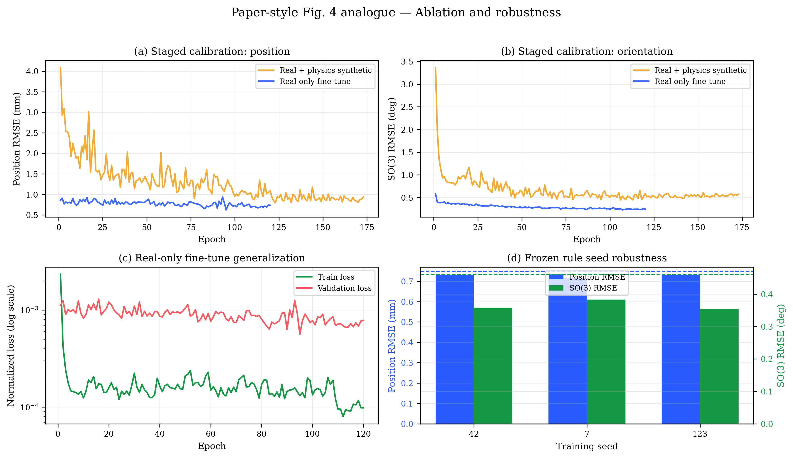
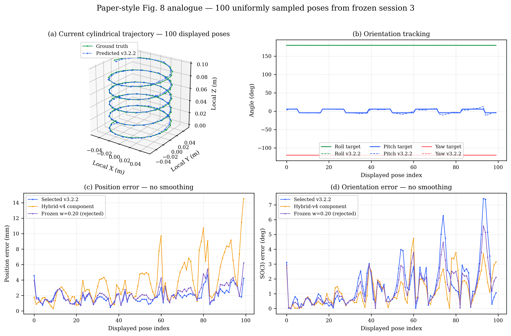
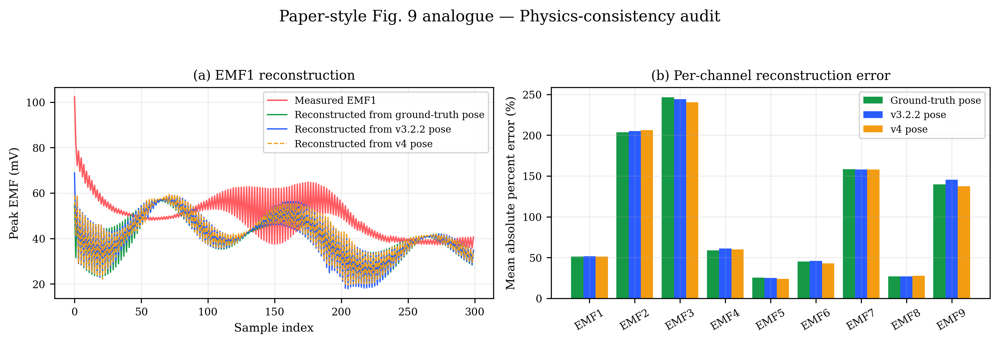

# Paper-style result report — 100 mm EMF localization

Generated by `reporting/build_paper_style_report.py`.

Detailed Vietnamese pipeline comparison and honest claim audit:
[BAO_CAO_SO_SANH_PIPELINE_VOI_BAI_BAO.md](../../docs/BAO_CAO_SO_SANH_PIPELINE_VOI_BAI_BAO.md).

This report mirrors the structure of Figs. 4, 7, 8, 9 and Tables I–III in the
reference paper, but it does **not** claim a direct numerical reproduction. The
paper uses a 500 mm workspace and broader orientation motion. The current
workspace is 100 mm and the protocols differ.

The final `cyl_rot` test is used here only for reporting the already frozen
one-time evaluation. No model or blend selection occurs in this script.

## Reproduce this report

```bash
# Run from the cloned repository root.
./.venv/bin/python reporting/build_paper_style_report.py \
  --out_dir reports/paper_style_2026_08_04
```

## Figures






Fig. 8 displays 100 uniformly sampled poses from the clean 1,000-row session 3
and does not smooth the error curves, matching the paper's display density.
It deliberately preserves the measured geometry: the current robot path is a
five-loop cylinder with an approximately constant 50 mm radius, whereas the
paper used a tapered five-loop helix. Plot styling cannot honestly create the
paper's large-bottom/small-top shape from the current data.



## Tables

- [Table I analogue — scenarios](tables/table1_scenario_performance.md)
- [Table II analogue — real-system benchmark](tables/table2_real_system_benchmark.md)
- [Table III analogue — method/features](tables/table3_method_comparison.md)
- [Physics reconstruction error](tables/table4_physics_reconstruction_error.md)

## Frozen final result

| Model | Position RMSE | Position p95 | SO(3) RMSE | SO(3) p95 |
|---|---:|---:|---:|---:|
| v3.2.2 selected | 1.1222 mm | 3.1047 mm | 2.3904 deg | 5.0578 deg |
| Frozen hybrid w=0.20 | 1.2335 mm | 3.4725 mm | 1.8653 deg | 3.7461 deg |

The hybrid improves orientation but regresses position, so v3.2.2 remains the
selected deployment. Choosing a new rule from these plots would be leakage.

Physics-reconstruction MAPE in Fig. 9 is a diagnostic based on the fitted
current forward model. The ground-truth-pose control separates forward-model
calibration error from inverse-network pose error. Mean per-channel MAPE is
106.19% even with ground-truth pose, versus
107.16% from v3.2.2 pose and 105.39%
from v4 pose. Therefore the dominant discrepancy is the current forward-model
calibration/channel mapping on rotating sessions, not the inverse network.
This is not the paper's reported <3.4% result and must not be presented as such.

The paper/current rows in Table II are context only. Even the workspace-edge
normalization does not make the studies directly comparable because the
trajectories, orientation ranges, sensors, splits, and error protocols differ.
