# Kịch bản trình bày: Paper EMF và pipeline hiện tại

Thời lượng mục tiêu: **15–18 phút**, 16 slide. Trạng thái model trong deck: `v3.2.2` selected deployment; mixed `v4.2` final-rejected; `v4.4` research-only.

## Cách dùng

- Deck PDF để trình chiếu: [SLIDE_DECK.pdf](SLIDE_DECK.pdf).
- Mỗi slide PNG 16:9 nằm trong `slides/`.
- Phần **Lời nói đề xuất** là kịch bản có thể đọc gần như nguyên văn.
- Bản 8 phút: trình bày slide 1, 2, 4, 5, 7, 9, 10, 13, 15, 16.
- Không đổi cụm từ “development-only”, “không head-to-head” và “research-only”.

## Slide 1 — Tái tạo bài báo EMF

**Thời lượng:** 0:25  
**Thông điệp duy nhất:** Đặt phạm vi: đối chiếu trung thực, không quảng cáo model.

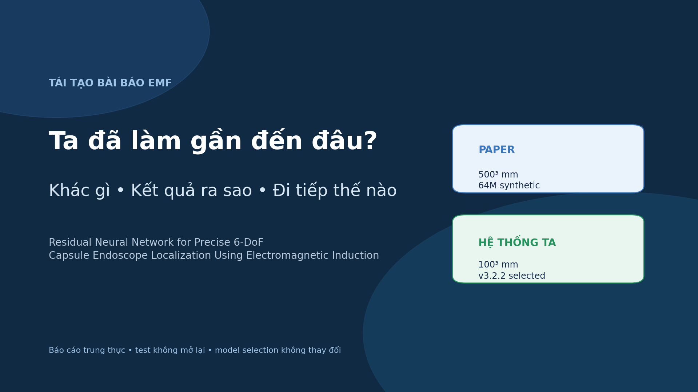

### Lời nói đề xuất

> Hôm nay tôi trình bày ba câu hỏi: chúng ta đã bám sát bài báo đến đâu, những thay đổi của ta có giá trị gì, và cần làm gì với bộ calibration mới. Điểm quan trọng là đây không phải bài trình bày để chứng minh ta tốt hơn paper; đây là một audit để biết chính xác trạng thái trước khi đi tiếp.

### Chuyển slide

> Trước tiên, tôi đưa kết luận ngay để mọi số liệu sau có đúng ngữ cảnh.

## Slide 2 — Kết luận trước

**Thời lượng:** 1:00  
**Thông điệp duy nhất:** Đúng hướng ở lõi; protocol mới; còn ba khoảng trống lớn.

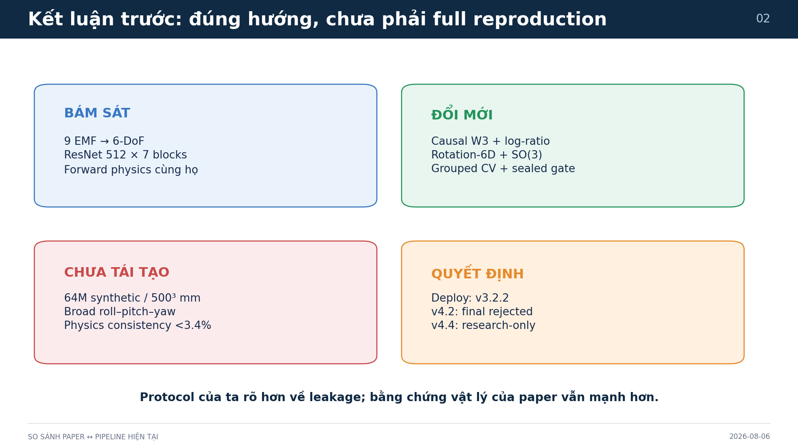

### Lời nói đề xuất

> Có bốn kết luận. Một, ta bám sát bài toán 9 EMF sang pose 6-DoF và giữ backbone ResNet gần paper. Hai, ta thêm temporal W3, log-ratio, rotation-6D và protocol chống leakage. Ba, ta chưa tái tạo quy mô 64 triệu synthetic, workspace 500 mm, broad angles và physics consistency của paper. Bốn, model triển khai vẫn là v3.2.2; v4.4 mới chỉ là research candidate. Vì vậy câu trả lời là: đúng hướng, nhưng chưa full reproduction.

### Chuyển slide

> Phần giống nhau bắt đầu từ chính bài toán vật lý.

## Slide 3 — Bài toán chung

**Thời lượng:** 0:50  
**Thông điệp duy nhất:** Cùng ánh xạ 9 EMF thành 6 thành phần pose.

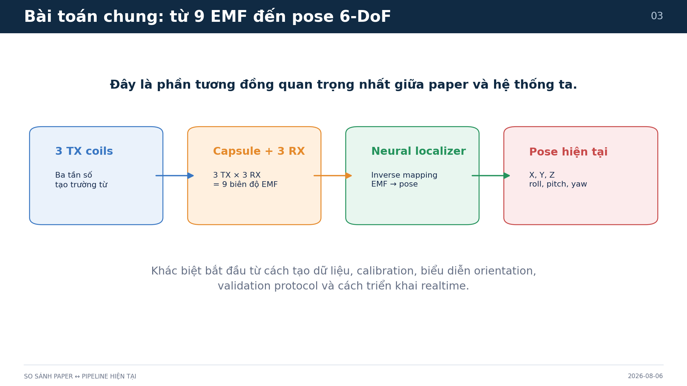

### Lời nói đề xuất

> Ba cuộn phát và ba trục nhận tạo chín biên độ EMF. Mạng inverse localizer biến chín tín hiệu đó thành X, Y, Z và orientation. Đây là phần ta tái tạo đúng nhất. Robot có vai trò cung cấp ground truth khi calibration; model vẫn là thành phần xác định pose của viên nang, không phải xác định pose của robot.

### Chuyển slide

> Từ cùng một bài toán, hai pipeline bắt đầu khác nhau ở cách tạo và kiểm định dữ liệu.

## Slide 4 — Hai pipeline

**Thời lượng:** 1:10  
**Thông điệp duy nhất:** Paper ưu tiên scale synthetic; ta ưu tiên fold-local calibration và gates.

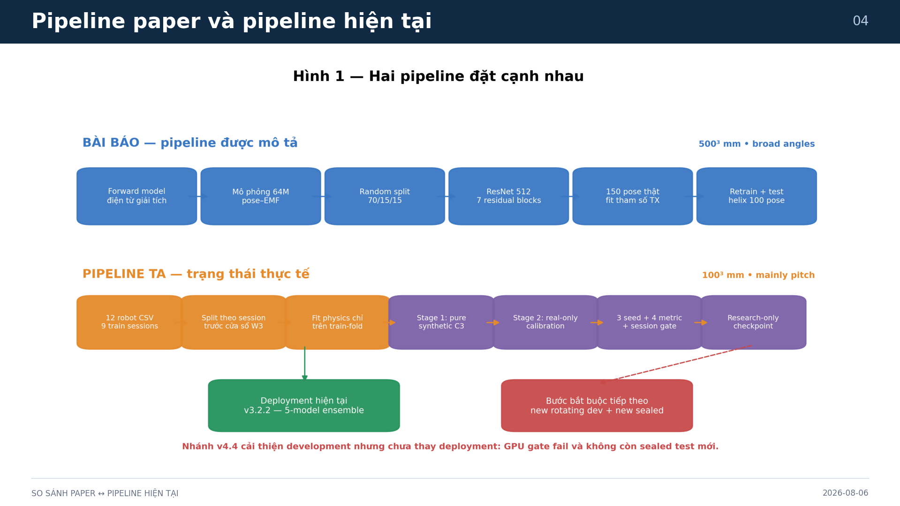

### Lời nói đề xuất

> Paper đi từ forward model giải tích, sinh 64 triệu mẫu, random split, train một ResNet, sau đó dùng 150 pose thật để hiệu chỉnh tham số TX và retrain. Ta đi từ 12 CSV robot, split theo session, fit physics chỉ trên train fold, pretrain synthetic rồi calibration real-only, xác nhận ba seed và nhiều quality gate. Nhánh màu xanh là deployment v3.2.2; nhánh v4.4 màu tím chưa được deploy vì latency gate và thiếu sealed test mới.

### Chuyển slide

> Khác biệt lớn nhất khi đọc các con số là scale dữ liệu và độ phủ pose.

## Slide 5 — Scale và coverage

**Thời lượng:** 1:15  
**Thông điệp duy nhất:** Không thể so trực tiếp 1.90 mm với 1.122 mm.

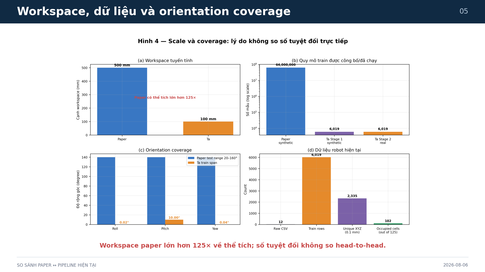

### Lời nói đề xuất

> Workspace paper có cạnh lớn hơn năm lần, tức thể tích lớn hơn 125 lần. Paper dùng 64 triệu synthetic; Stage 1 của ta chỉ khoảng năm nghìn mỗi fold và 6.019 cho deployment. Điểm quan trọng hơn là orientation: dữ liệu train của ta chỉ đổi roll 0.02 độ, pitch 10 độ và yaw 0.04 độ, trong khi paper đánh giá góc rộng. Do đó sai số millimeter nhỏ hơn không chứng minh hệ thống ta tốt hơn paper.

### Chuyển slide

> Vậy synthetic và calibration của ta được dùng như thế nào?

## Slide 6 — Synthetic và calibration

**Thời lượng:** 1:30  
**Thông điệp duy nhất:** Cùng mục đích giảm sim-to-real gap; thứ tự vật lý không hoàn toàn giống.

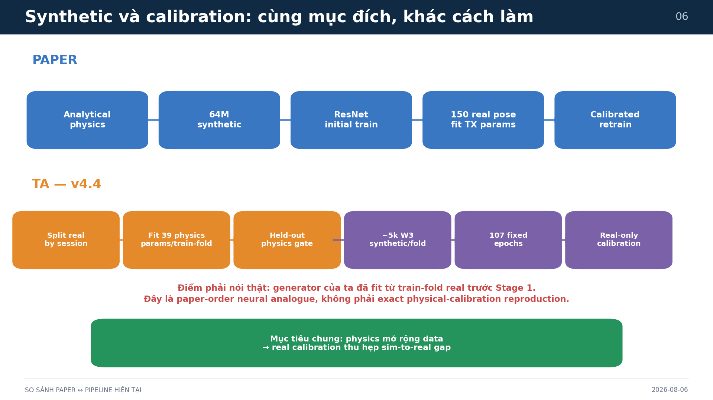

### Lời nói đề xuất

> Mục đích chung là dùng physics để có nhiều cặp pose–EMF rồi dùng real calibration để thu hẹp sim-to-real gap. Paper sinh analytical synthetic trước, rồi dùng 150 pose để fit TX và retrain. Ta fit 39 tham số physics trên train fold trước, kiểm tra held-out gate, sau đó sinh W3 synthetic, train 107 epoch cố định và fine-tune real-only. Vì synthetic của ta đã phụ thuộc train-fold real, tôi gọi đây là paper-order neural analogue, không gọi là exact reproduction. Ưu điểm là tránh leakage; nhược điểm là synthetic bị giới hạn bởi coverage và sai số của calibration hiện tại.

### Chuyển slide

> Trên nền dữ liệu đó, backbone giống paper nhưng input và output đã thay đổi rõ rệt.

## Slide 7 — Kiến trúc mạng

**Thời lượng:** 1:15  
**Thông điệp duy nhất:** Đổi mới nằm ở feature, orientation và composition, không ở việc làm ResNet sâu hơn.

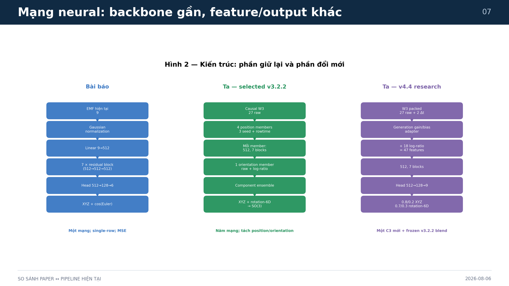

### Lời nói đề xuất

> Paper dùng một row chín EMF, chuẩn hóa Gaussian, width 512, bảy residual block và đầu ra XYZ cộng cos Euler. Ta giữ width, depth, block và activation để bám paper. v3.2.2 dùng năm model: bốn member cho position và một log-ratio member cho orientation. v4.4 thêm generation gain/bias adapter, 47 feature nội bộ và rotation-6D. Rotation-6D được chiếu về SO(3), xử lý hình học quay tốt hơn cos-Euler.

### Chuyển slide

> Những thay đổi này chỉ đáng tin nếu validation không bị lẫn session hoặc temporal window.

## Slide 8 — Leakage audit

**Thời lượng:** 1:15  
**Thông điệp duy nhất:** Protocol ta rõ hơn, nhưng không có bằng chứng paper bị leakage.

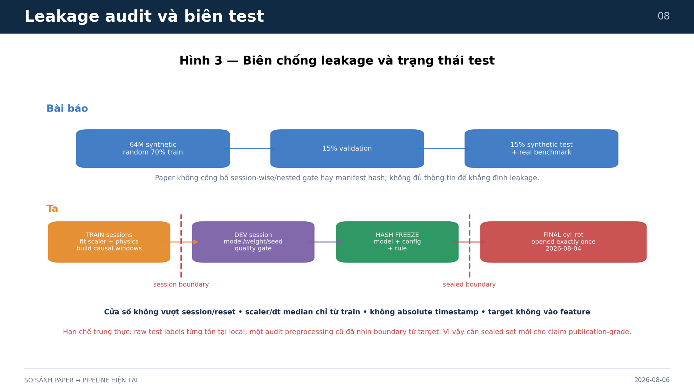

### Lời nói đề xuất

> Ta split complete session trước khi fit scaler, physics hoặc tạo W3. Window không vượt reset, session hay generation; absolute timestamp và row index không đi vào feature. Candidate được chọn trên development, hash freeze rồi cyl_rot chỉ mở một lần. Tuy vậy, raw test labels từng tồn tại local và một audit cũ từng nhìn target-derived boundary, nên claim publication-grade cần sealed set mới. Paper không công bố các biên này; điều đó không cho phép ta kết luận paper có leakage.

### Chuyển slide

> Với protocol development đó, v4.4 cho tín hiệu cải thiện khá nhất quán.

## Slide 9 — Development CV

**Thời lượng:** 1:05  
**Thông điệp duy nhất:** V4.4 thắng cả bốn metric ở cả ba seed trên development.

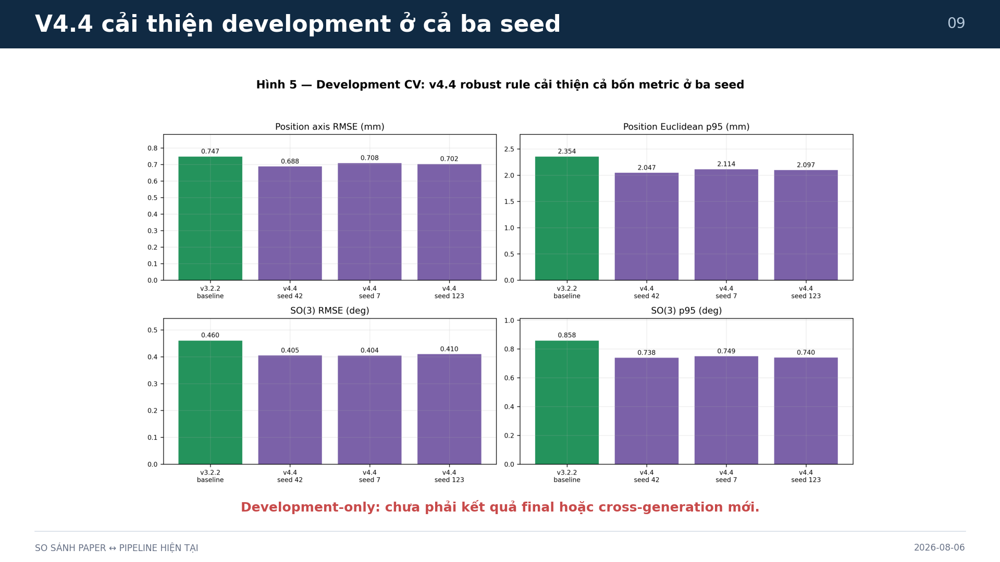

### Lời nói đề xuất

> Baseline matched-fold có position RMSE 0.747 mm, position p95 2.354 mm, SO3 RMSE 0.460 độ và p95 0.858 độ. Rule v4.4 dùng 20 phần trăm C3 cho position và 30 phần trăm cho orientation. Cả seed 42, 7 và 123 đều cải thiện cả bốn metric và qua session p95 gate. Đây là bằng chứng development tốt, nhưng chưa phải bằng chứng final hoặc cross-generation.

### Chuyển slide

> Lý do phải phân biệt development và final thể hiện rất rõ ở thí nghiệm v4.2 trước đó.

## Slide 10 — Quyết định final

**Thời lượng:** 1:05  
**Thông điệp duy nhất:** Mixed v4.2 cải thiện orientation nhưng làm xấu position nên bị loại.

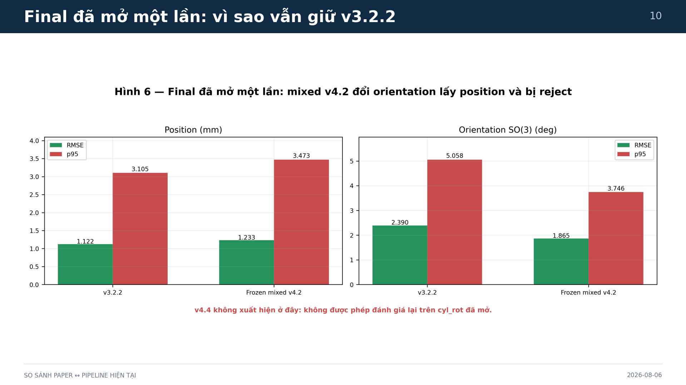

### Lời nói đề xuất

> Trên final đã mở một lần, v3.2.2 đạt position RMSE 1.122 mm và p95 3.105 mm; SO3 RMSE 2.390 độ và p95 5.058 độ. Mixed v4.2 giảm lỗi orientation, nhưng position tăng lên 1.233 mm và p95 3.473 mm. Vì gate yêu cầu cả bốn metric, v4.2 bị reject. Quan trọng: v4.4 không xuất hiện trên hình này vì ta không được đánh giá lại trên cyl_rot đã mở.

### Chuyển slide

> Khi đặt cạnh kết quả paper, ta phải giữ nguyên nguyên tắc không head-to-head.

## Slide 11 — So với paper

**Thời lượng:** 0:55  
**Thông điệp duy nhất:** Số tuyệt đối chỉ là context, không phải thứ hạng.

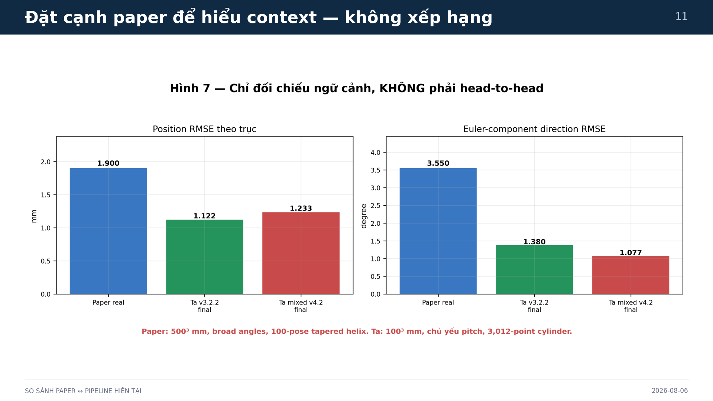

### Lời nói đề xuất

> Paper báo 1.90 mm position và 3.55 độ direction trên setup thật. Ta có số nhỏ hơn trên một số metric, nhưng điều kiện dễ và hẹp hơn rất nhiều. Hình cố ý ghi không head-to-head: khác workspace, quỹ đạo, orientation, sensor, split và metric tail. Câu đúng là model ta hoạt động tốt trong workspace hiện tại; câu sai là model ta đã outperform paper.

### Chuyển slide

> Sự khác biệt quỹ đạo cũng giải thích vì sao Fig. 8 của ta nhìn không giống paper.

## Slide 12 — Vì sao Fig. 8 khác?

**Thời lượng:** 0:55  
**Thông điệp duy nhất:** Paper dùng tapered helix; robot ta tạo cylinder bán kính gần như không đổi.

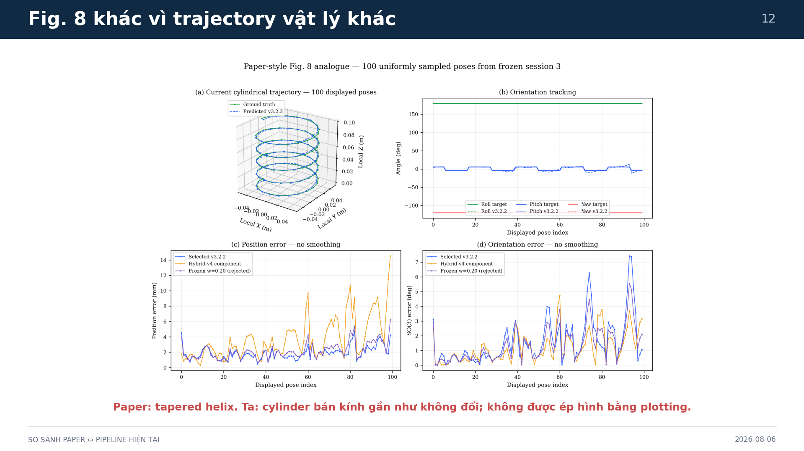

### Lời nói đề xuất

> Paper có đường xoắn năm vòng với bán kính thu nhỏ dần, nên hình giống một hình nón: dưới to, trên nhỏ. Dữ liệu hiện tại của ta là cylinder bán kính khoảng 50 mm gần như không đổi. Ta đã lấy 100 điểm uniform và không smooth error. Vì vậy hình đều hơn là đúng dữ liệu. Ép đường ta thành taper bằng plotting sẽ làm đẹp hình nhưng sai khoa học. Muốn giống paper, phải lập trình robot chạy tapered helix mới.

### Chuyển slide

> Khoảng trống nghiêm trọng hơn hình dáng trajectory là physics consistency.

## Slide 13 — Khoảng trống physics

**Thời lượng:** 1:15  
**Thông điệp duy nhất:** Forward model pass gate cục bộ nhưng thất bại trên rotating final.

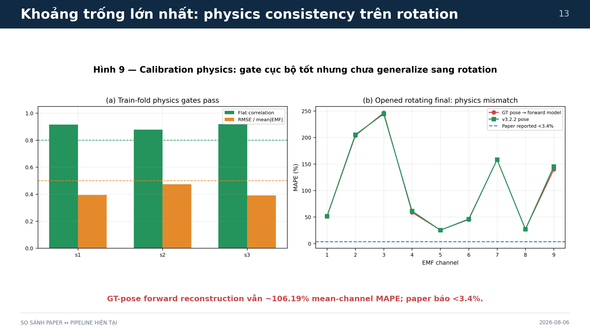

### Lời nói đề xuất

> Ở ba fold development, correlation 0.878 đến 0.918 và RMSE trên mean EMF 0.390 đến 0.474, nên generator được phép chạy. Nhưng trên rotating final, ngay cả đưa ground-truth pose vào forward model, mean channel MAPE vẫn 106.19 phần trăm, trong khi paper báo dưới 3.4 phần trăm. Việc đường GT-pose và predicted-pose gần nhau cho thấy lỗi chính nằm ở channel mapping, polarity, pose frame hoặc physical model, không phải chỉ ở inverse neural network.

### Chuyển slide

> Sau khi sửa lớp vật lý, model mới có thể được đưa vào luồng realtime hoàn chỉnh.

## Slide 14 — Realtime và TCP/IP

**Thời lượng:** 1:05  
**Thông điệp duy nhất:** Model định vị capsule; TCP/IP chỉ là transport tới robot/controller.

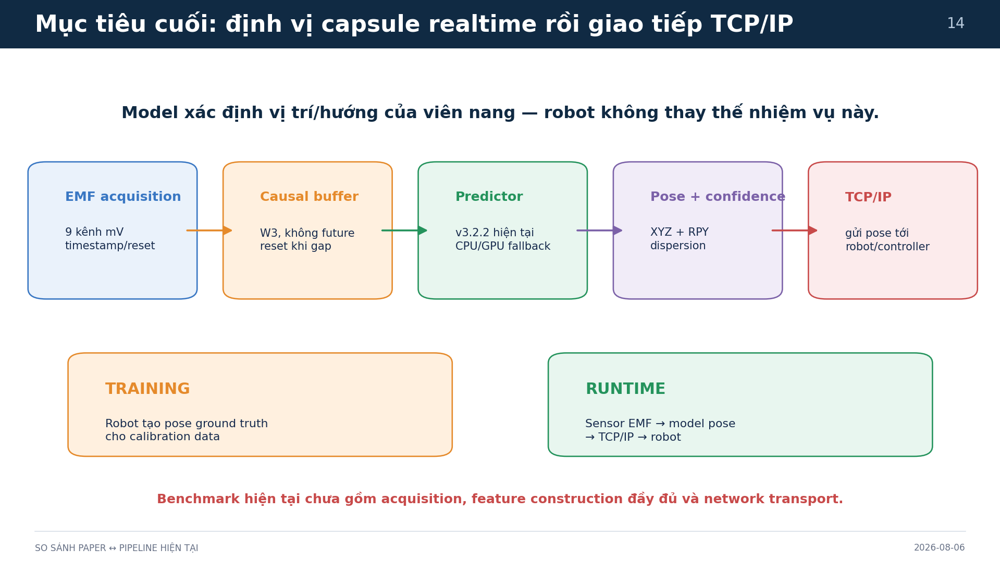

### Lời nói đề xuất

> Ở runtime, sensor gửi chín EMF cùng timestamp và reset. Buffer tạo W3 nhân quả, predictor trả pose và confidence, rồi TCP/IP chuyển kết quả tới robot hoặc controller. Robot tạo ground truth khi training, nhưng không được đưa target robot vào inference nếu capsule thực tế không có tín hiệu đó. v3.2.2 hiện đạt GPU p95 0.858 ms và CPU 1.290 ms cho inference core; benchmark end-to-end vẫn phải cộng acquisition, feature, confidence và network.

### Chuyển slide

> Với bộ calib mới, ta sẽ đi theo sáu gate thay vì train ngay một model lớn hơn.

## Slide 15 — Roadmap bộ calib mới

**Thời lượng:** 1:30  
**Thông điệp duy nhất:** Dữ liệu và hardware verification đi trước model selection.

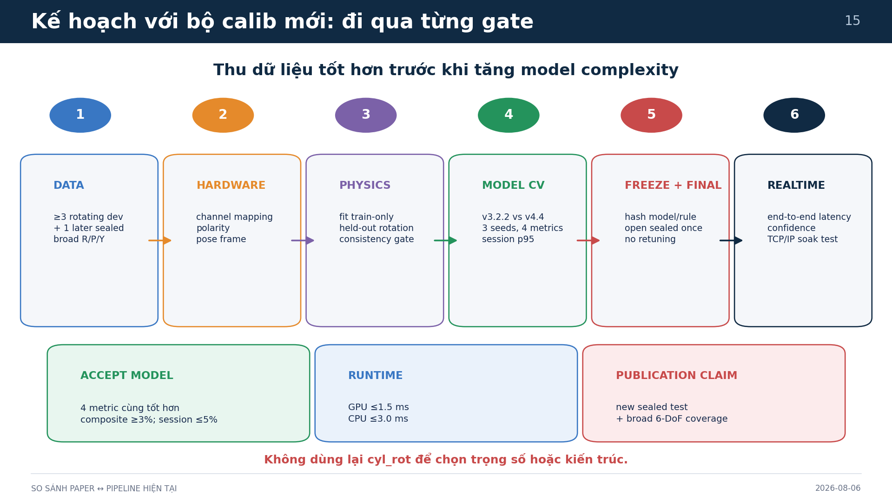

### Lời nói đề xuất

> Bước một, thu ít nhất ba rotating development session và một later sealed session, mở rộng roll, pitch, yaw độc lập. Bước hai, xác minh channel mapping, polarity và pose frame. Bước ba, fit physics train-only và kiểm tra trên held-out rotation. Bước bốn, so v3.2.2 với v4.4 bằng ba seed, bốn metric và session p95. Bước năm, hash freeze rồi mở sealed đúng một lần. Bước sáu, benchmark end-to-end và TCP/IP soak test. Gate model giữ nguyên: bốn metric cùng tốt hơn, composite ít nhất ba phần trăm, không session nào xấu quá năm phần trăm, GPU dưới 1.5 ms và CPU dưới 3 ms.

### Chuyển slide

> Tôi kết thúc bằng ba điều cần nhớ.

## Slide 16 — Kết luận

**Thời lượng:** 0:40  
**Thông điệp duy nhất:** Giữ v3.2.2; v4.4 research-only; ưu tiên calib broad 6-DoF và physics verification.

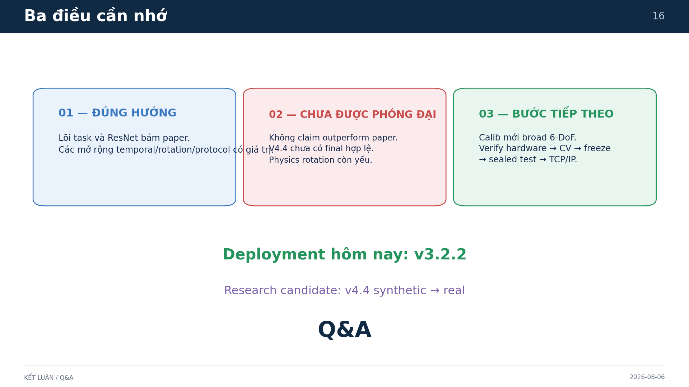

### Lời nói đề xuất

> Một, ta đi đúng hướng và có nhiều mở rộng hợp lý. Hai, chưa được claim full reproduction hay outperform paper; v4.4 chưa có final hợp lệ và physics rotation còn yếu. Ba, bộ calib mới cần được thiết kế để mở rộng 6-DoF, xác minh phần cứng, rồi mới CV, freeze, sealed test và tích hợp TCP/IP. Deployment hôm nay vẫn là v3.2.2.

### Chuyển slide

> Xin mời câu hỏi.

## Câu hỏi có khả năng được hỏi

### Vì sao không chọn v4.4 ngay khi development tốt hơn?

Vì GPU p95 1.723 ms vượt gate 1.5 ms và không còn sealed test mới. Đưa vào deployment lúc này sẽ phá protocol đã định trước.

### Kết quả 1.122 mm có tốt hơn 1.90 mm của paper không?

Không được kết luận như vậy. Workspace, orientation coverage, trajectory, phần cứng và protocol test khác nhau.

### Timestamp có giúp không?

Chỉ khi khoảng lấy mẫu thực sự biến thiên hoặc có dropout/gap. Dữ liệu hiện tại mỗi row là một bước lập trình cố định, nên constant `dt_ratio=1` không mang timing information mới; W3 vẫn có ích vì chứa lịch sử EMF nhân quả.

### Synthetic có nên tăng lên hàng triệu mẫu không?

Chưa. Forward model hiện sai lớn trên rotation. Tăng synthetic từ một generator sai chỉ khuếch đại bias. Phải xác minh hardware/frame và held-out rotating physics trước.

### Robot có phải đối tượng model định vị không?

Không. Robot cung cấp pose ground truth khi calibration. Ở runtime model định vị capsule từ EMF; TCP/IP chuyển pose dự đoán tới robot/controller.
