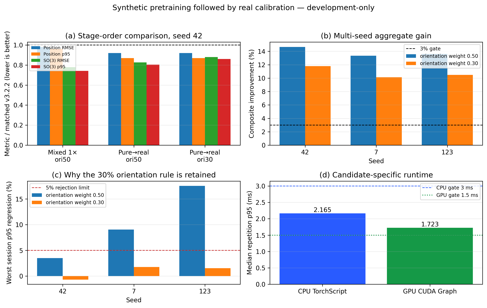

# Synthetic pretraining rồi real calibration — báo cáo development-only

Thí nghiệm này kiểm tra trực tiếp thứ tự học gần tinh thần bài báo hơn: Stage 1
chỉ dùng physics-synthetic, Stage 2 chỉ dùng calibration thật. Không file nhãn
`cyl_rot` hay prediction final cũ nào được script báo cáo này đọc.

## Kết quả

| Protocol | Seed | Position RMSE (mm) | Position p95 (mm) | SO(3) RMSE (deg) | SO(3) p95 (deg) | Accuracy/session gate |
|---|---|---|---|---|---|---|
| v3.2.2 matched baseline | none | 0.7474 | 2.3539 | 0.4602 | 0.8580 | reference |
| Mixed real+synthetic 1×, pos20/ori50 | 42 | 0.7327 | 2.2613 | 0.3586 | 0.6362 | accepted |
| Pure synthetic→real, pos20/ori50 | 42 | 0.6878 | 2.0470 | 0.3800 | 0.6892 | accepted |
| Pure synthetic→real, pos20/ori30 | 42 | 0.6878 | 2.0470 | 0.4048 | 0.7384 | accepted |
| Pure synthetic→real, pos20/ori30 | 7 | 0.7077 | 2.1137 | 0.4045 | 0.7495 | accepted |
| Pure synthetic→real, pos20/ori30 | 123 | 0.7021 | 2.0971 | 0.4096 | 0.7395 | accepted |

Rule ổn định là `position = 0.8*v3.2.2 + 0.2*C3` và
`rotation6D = 0.7*v3.2.2 + 0.3*C3`. Cả seed 42, 7 và 123 đều cải thiện cả bốn
metric aggregate, composite gain lần lượt 11.78%,
10.12% và
10.49%, đồng thời qua
session-p95 gate. Trung bình ba seed: position RMSE 0.6992 mm,
position p95 2.0859 mm, SO(3) RMSE
0.4063° và SO(3) p95 0.7425°.

Candidate-specific CPU p95 là 2.1648 ms và qua ngưỡng 3 ms.
GPU p95 là 1.7234 ms, vượt ngưỡng 1.5 ms; vì vậy final
development gate tổng thể vẫn fail. Checkpoint chỉ là research candidate và
không thay v3.2.2. CPU/GPU pose parity đạt
0.00003052, timestamp-offset difference bằng
0.0.

## So với thứ tự của bài báo

| Step | Reference paper | Current analogue |
|---|---|---|
| Initial inverse dataset | 64M analytical synthetic samples in 500 mm cube | ~5k fold-specific calibrated-physics synthetic W3 samples in 100 mm cube |
| Physical calibration | 150 random real poses fit effective TX position/orientation/turns | Up to 1200 train-fold real rows fit 39 parameters; held-out physics gate |
| Retraining/calibration | Calibrated parameters incorporated into forward/inverse models; details ambiguous | 107 fixed pure-synthetic epochs, then real-only fine-tune with normalization rebase |
| Validation | 100-pose broad-angle five-loop helix | Three leave-one-con_rot-session-out folds; mainly pitch motion |

Điểm cần nói thật: bài báo tạo analytical synthetic trước, sau đó dùng 150 pose
thật để fit tham số TX và nói rằng calibrated parameters được đưa vào forward
và inverse models để retrain. Bài báo không mô tả đủ chi tiết retrain dataset.
Thí nghiệm hiện tại chứng minh lợi ích của **thứ tự neural training**
synthetic-only rồi real-only, nhưng synthetic của ta đã được sinh từ forward
model fit theo train fold. Vì vậy đây là analogue có kiểm soát leakage, không
phải tái tạo chính xác calibration order của bài báo.

## Quyết định

- Hướng synthetic trước rồi calibration thật là có giá trị và tốt hơn mixed
  training về position trên development hiện tại.
- Chưa được triển khai: GPU latency gate fail và không còn sealed test mới.
- `cyl_rot` không được mở lại. Cần session mới để xác nhận candidate.
