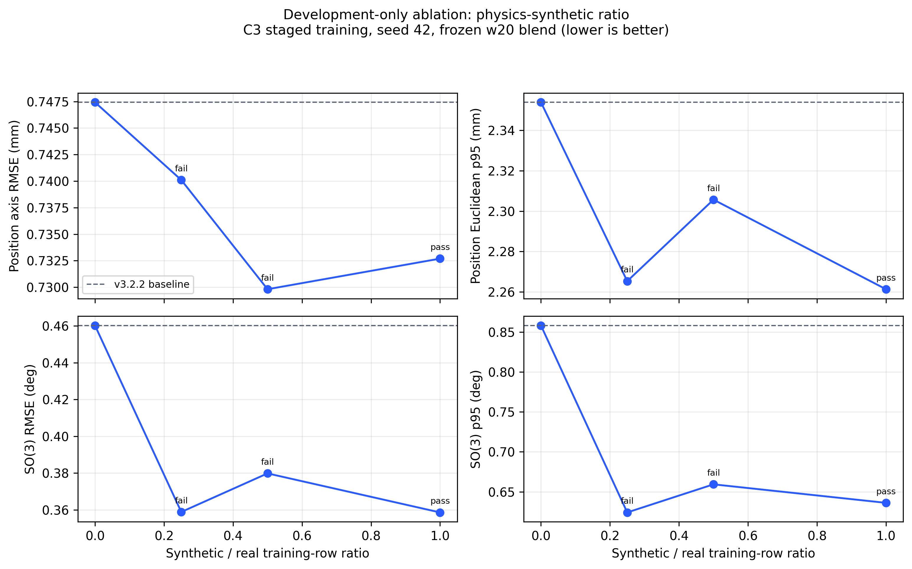

# Physics-synthetic/calibration ratio ablation

This is a development-only screen on the three grouped `con_rot` folds. Synthetic rows occur only in fold training; validation is real-only. The experiment does not read or score the already-opened `cyl_rot` final.



## Results

| Model | Synthetic / real | Position RMSE (mm) | Position p95 (mm) | SO(3) RMSE (deg) | SO(3) p95 (deg) | Composite gain vs v3.2.2 (%) | Worst session p95 regression (%) | Development gate | Final status |
|---|---|---|---|---|---|---|---|---|---|
| v3.2.2 development baseline | 0.0000 | 0.7474 | 2.3539 | 0.4602 | 0.8580 | 0.0000 | 0.0000 | reference | selected deployment |
| C3 staged + frozen w20 | 0.2500 | 0.7401 | 2.2653 | 0.3588 | 0.6242 | 14.2572 | 8.0781 | rejected | not evaluated on final; new sealed data required |
| C3 staged + frozen w20 | 0.5000 | 0.7298 | 2.3057 | 0.3798 | 0.6594 | 11.7501 | 6.1270 | rejected | not evaluated on final; new sealed data required |
| C3 staged + frozen w20 | 1.0000 | 0.7327 | 2.2613 | 0.3586 | 0.6362 | 14.1176 | 2.7143 | accepted | historical final rejected; do not reopen |

## Decision

Ratios `0.25` and `0.50` improve all four aggregate metrics over the matched-fold v3.2.2 reference, but fail the predeclared per-session p95 gate: fold-s3 SO(3) p95 regresses by 8.08% and 6.13%. Ratio `1.00` remains the only balanced development pass, but its frozen one-time final result already failed position. The deployable model therefore remains v3.2.2.

Latency for the two rejected screening ratios is an explicitly marked architecture-matched proxy, not a new candidate-specific benchmark.

## Rebuild

```bash
# Run from the cloned repository root.
./.venv/bin/python evaluation/summarize_synthetic_ratio_ablation_v4.py
```
